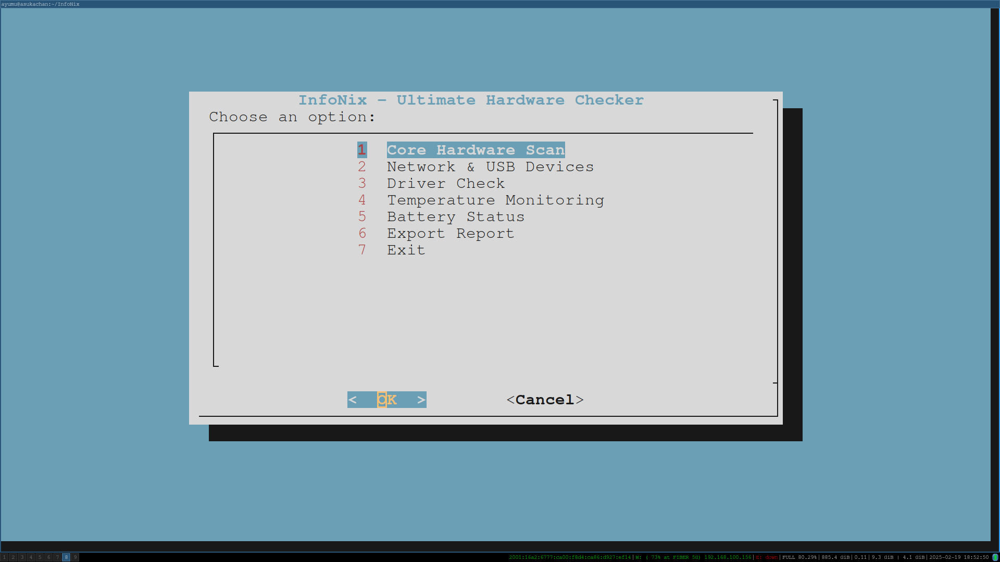

# InfoNix - Linux Hardware Compatibility Checker

Boost your Linux system’s compatibility and performance with InfoNix – the most comprehensive hardware checker and diagnostic tool. 

---

##  Features:
- Interactive UI with color-coded sections.
- Detailed CPU, GPU, RAM, Storage, and Network information.
- Driver checks for NVIDIA, AMD, Wi-Fi, Audio, and Bluetooth.
- Real-time temperature and battery monitoring.
- Export reports in `.txt`, `.json`, and `.html`.
- Fast and efficient with optimized command execution.

---

##  Installation:
```bash
git clone https://github.com/your-username/InfoNix.git
cd InfoNix
chmod +x hardware_checker.sh

##  Main Menu
Here’s how the interactive main menu looks:


